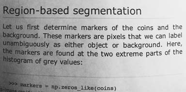
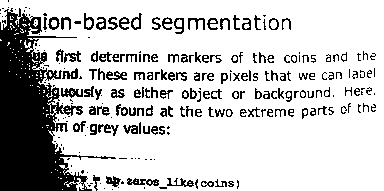
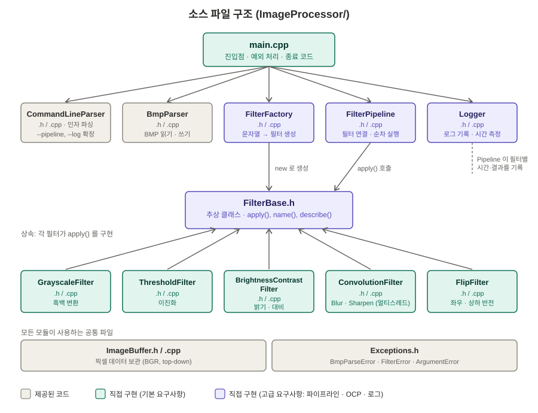

# ImageProcessor

C++17 과 STL 만으로 구현한 CLI 기반 BMP 이미지 처리 프로그램입니다. (24비트 BMP 지원, 외부 라이브러리 없음)

## 구현 항목

### 기본 요구사항

| 항목 | 상태 | 비고 |
|---|---|---|
| BMP 파일 입출력 | ✅ 완료 | 제공된 `BmpParser` 활용 |
| CLI 인자 처리 | ✅ 완료 | `--input` / `--output` / `--filter` (제공) + `--pipeline`, `--log` 추가 |
| Grayscale 변환 | ✅ 완료 | BT.601 가중치 `0.299 R + 0.587 G + 0.114 B` |
| 밝기 / 대비 조절 | ✅ 완료 | 결과를 0~255 로 클램핑 |
| 이진화 (Thresholding) | ✅ 완료 | 임계값을 파라미터로 지정 |
| 3x3 Convolution (Blur, Sharpen) | ✅ 완료 | 커널 직접 구현, 가장자리는 가장 가까운 픽셀로 대체 |
| 상하 / 좌우 반전 | ✅ 완료 | 상하는 행 단위 `memcpy`, 좌우는 픽셀(3바이트) 단위 복사 |
| 히스토그램 분석 | ❌ 미구현 | 시간 관계상 제외 |
| 이미지 크롭 / 리사이즈 | ❌ 미구현 | 시간 관계상 제외 |
| 결과 BMP 저장 | ✅ 완료 | 제공된 `BmpParser` 활용 |

### 고급 요구사항

| 항목 | 상태 | 비고 |
|---|---|---|
| 필터 파이프라인 체인 | ✅ 완료 | `--pipeline "grayscale, blur, threshold:128"` |
| 추상 클래스 기반 설계 (OCP) | ✅ 완료 | `FilterBase` 상속 구조 + `FilterFactory` |
| 멀티쓰레드 병렬 처리 | ✅ 완료 | Blur / Sharpen 을 이미지를 위아래 띠로 나눠 병렬 처리 (최대 약 4배) |
| 로그 파일 출력 | ✅ 완료 | 처리 시간, 필터 파라미터, 성공/실패 여부 기록 |

## 빌드 방법

- 개발 환경: Visual Studio 2022 (플랫폼 도구 집합 v143), C++17
- `ImageProcessor.sln` 을 열고 구성을 **Release / x64** 로 선택한 뒤 **빌드 → 솔루션 다시 빌드**
- 실행 파일: `x64\Release\ImageProcessor.exe`

> 콘솔 프로그램이라 더블클릭하면 인자 없이 실행되어 사용법만 출력하고 바로 종료됩니다. 터미널에서 인자와 함께 실행하세요.

## 사용법

```
ImageProcessor.exe --input <path> --output <path> --filter <name>
ImageProcessor.exe --input <path> --output <path> --pipeline <list>
```

| 옵션 | 설명 |
|---|---|
| `-i`, `--input <path>` | 입력 BMP 파일 (24비트, 무압축) |
| `-o`, `--output <path>` | 출력 BMP 파일 |
| `-f`, `--filter <name>` | 필터 1개 지정 |
| `-p`, `--pipeline <list>` | 필터를 `,` 로 연결해 순서대로 적용 (`--filter` 와 둘 중 하나만 지정) |
| `-l`, `--log <path>` | 처리 로그를 파일에 이어쓰기 (생략하면 로그를 남기지 않음) |
| `-h`, `--help` | 사용법 출력 |

### 필터 목록

필터 이름과 인자는 `:` 로 구분합니다. 이름은 대소문자를 구분하지 않고 공백은 무시됩니다.

| 필터 | 형식 | 설명 |
|---|---|---|
| Grayscale | `grayscale` | 흑백 변환 |
| 이진화 | `threshold:<0~255>` | 밝기가 임계값 이상이면 흰색, 미만이면 검은색 |
| 밝기/대비 | `bc:<밝기>:<대비>` (`brightness_contrast`) | 밝기 -255~255, 대비 배율 0~5 (1.0 = 변화 없음). 대비 적용 후 밝기를 더함 |
| Blur | `blur` / `blur:<스레드>` | 3x3 가우시안 근사 커널 |
| Sharpen | `sharpen` / `sharpen:<스레드>` | 3x3 샤프닝 커널 |
| 반전 | `flip:h` / `flip:v` | h = 좌우 반전, v = 상하 반전 |

- Blur / Sharpen 의 스레드 수: **생략하면 CPU 코어 수만큼 자동**, `1` 이면 싱글스레드, 그 외 1~64 의 값을 직접 지정할 수 있습니다.

## 실행 결과

모든 결과 BMP 는 [`Results/`](Results) 폴더에 있습니다. (원본은 [`Resource/`](Resource))

| 원본 | 결과 |
|---|---|
|  |  |
| 1_astronaut.bmp (512x512) | **Grayscale** |

```powershell
.\x64\Release\ImageProcessor.exe --input .\Resource\1_astronaut.bmp --output .\Results\01_grayscale.bmp --filter grayscale
```

| 원본 | 결과 |
|---|---|
|  |  |
| 4_text_page.bmp (384x191) | **이진화** `threshold:128` |

```powershell
.\x64\Release\ImageProcessor.exe --input .\Resource\4_text_page.bmp --output .\Results\02_threshold_128.bmp --filter threshold:128
```

글자는 또렷하게 분리되지만, 왼쪽의 그림자 진 부분은 밝기가 임계값보다 낮아 검게 뭉개집니다. 하나의 고정 임계값으로 판정하는 이진화의 한계입니다.

| 원본 | 결과 |
|---|---|
|  |  |
| 2_coffee.bmp (600x400) | **밝기/대비** `bc:30:1.4` (밝기 +30, 대비 1.4배) |

```powershell
.\x64\Release\ImageProcessor.exe --input .\Resource\2_coffee.bmp --output .\Results\03_brightness_contrast.bmp --filter bc:30:1.4
```

| 원본 | Blur | Sharpen |
|---|---|---|
|  |  |  |
| 3_chelsea_cat.bmp (451x300) | `blur` | `sharpen` |

```powershell
.\x64\Release\ImageProcessor.exe --input .\Resource\3_chelsea_cat.bmp --output .\Results\04_blur.bmp --filter blur
.\x64\Release\ImageProcessor.exe --input .\Resource\3_chelsea_cat.bmp --output .\Results\05_sharpen.bmp --filter sharpen
```

| 좌우 반전 | 상하 반전 |
|---|---|
|  |  |
| `flip:h` | `flip:v` |

```powershell
.\x64\Release\ImageProcessor.exe --input .\Resource\3_chelsea_cat.bmp --output .\Results\06_flip_horizontal.bmp --filter flip:h
.\x64\Release\ImageProcessor.exe --input .\Resource\3_chelsea_cat.bmp --output .\Results\07_flip_vertical.bmp --filter flip:v
```

### 필터 파이프라인 (고급)

| 파이프라인 `grayscale, blur, threshold:128` | 블러 10번 `blur` x 10 |
|---|---|
|  |  |

```powershell
.\x64\Release\ImageProcessor.exe --input .\Resource\3_chelsea_cat.bmp --output .\Results\08_pipeline.bmp --pipeline "grayscale, blur, threshold:128"
.\x64\Release\ImageProcessor.exe --input .\Resource\3_chelsea_cat.bmp --output .\Results\09_blur_x10.bmp --pipeline "blur, blur, blur, blur, blur, blur, blur, blur, blur, blur"
```

콘솔 출력 예:
```
Loaded: 451 x 300
Applied: grayscale -> blur:12 -> threshold:128
Saved:  .\Results\08_pipeline.bmp
```

## 로그 파일 (고급)

`--log <path>` 를 지정하면 처리 과정을 파일에 이어서 기록합니다. 전체 샘플은 [`Results/sample_run.txt`](Results/sample_run.txt) 에 있습니다.

```powershell
.\x64\Release\ImageProcessor.exe --input .\Resource\3_chelsea_cat.bmp --output .\Results\08_pipeline.bmp --pipeline "grayscale, blur, threshold:128" --log .\Results\sample_run.txt
```

```
[2026-10-03 14:45:44] [INFO ] START input=.\Resource\3_chelsea_cat.bmp output=.\Results\08_pipeline.bmp pipeline="grayscale, blur, threshold:128"
[2026-10-03 14:45:44] [INFO ] LOADED 451x300
[2026-10-03 14:45:44] [INFO ] PIPELINE grayscale -> blur:12 -> threshold:128
[2026-10-03 14:45:44] [INFO ] FILTER grayscale time=0.31ms
[2026-10-03 14:45:44] [INFO ] FILTER blur:12 time=2.21ms
[2026-10-03 14:45:44] [INFO ] FILTER threshold:128 time=0.19ms
[2026-10-03 14:45:44] [INFO ] SAVED .\Results\08_pipeline.bmp
[2026-10-03 14:45:44] [INFO ] SUCCESS total=7.31ms
```

| 기록 항목 | 로그에서 |
|---|---|
| 처리 시간 | `FILTER ... time=`, `SUCCESS total=` |
| 필터 파라미터 | `PIPELINE ...` (`blur:12` 는 실제 사용한 스레드 수) |
| 성공 / 실패 | `SUCCESS`, 또는 `FAILED exit=<종료 코드> reason=<사유>` |

- 한 줄을 쓸 때마다 즉시 디스크에 반영(flush)하므로 비정상 종료돼도 기록이 남습니다.
- 로그 파일을 열 수 없어도 이미지 처리는 계속되고 경고만 출력합니다.
- 인자 오류(종료 코드 4)는 로그 경로를 알기 전에 발생할 수 있어 콘솔에만 출력됩니다.

## 멀티쓰레드 성능 (고급)

Blur / Sharpen 은 이미지를 위아래 띠로 나눠 스레드마다 한 띠를 맡아 계산합니다.

- 원본은 모든 스레드가 **읽기만** 하고, 결과는 스레드마다 **서로 다른 행에만** 쓰므로 락(mutex) 없이 안전합니다.
- 스레드 수와 관계없이 결과 이미지가 항상 동일함을 확인했습니다 (파일 해시 일치).

측정 조건: 512x512 이미지, 12코어 PC, Release 빌드, 블러를 10번 연속 적용 (`--log` 의 필터별 시간으로 계산, 첫 회 제외 평균)

| 스레드 수 | 블러 1회 평균 | 싱글 대비 | 10회 전체 시간 (파일 읽기/쓰기 포함) |
|---|---|---|---|
| 1 (`blur:1`) | 8.99 ms | 1.00배 | 97.97 ms |
| 2 (`blur:2`) | 5.10 ms | 1.76배 | 58.28 ms |
| 4 (`blur:4`) | 2.85 ms | 3.15배 | 36.77 ms |
| 12 (`blur`, 자동) | 2.20 ms | 4.08배 | 29.68 ms |

```powershell
.\x64\Release\ImageProcessor.exe --input .\Resource\1_astronaut.bmp --output .\Results\blur10_t1.bmp --pipeline "blur:1, blur:1, blur:1, blur:1, blur:1, blur:1, blur:1, blur:1, blur:1, blur:1" --log perf.txt
.\x64\Release\ImageProcessor.exe --input .\Resource\1_astronaut.bmp --output .\Results\blur10_t4.bmp --pipeline "blur:4, blur:4, blur:4, blur:4, blur:4, blur:4, blur:4, blur:4, blur:4, blur:4" --log perf.txt
```

- 이미지가 작아서 12개로 나누면 스레드당 약 43행뿐이라, 스레드를 만들고 합치는 비용 때문에 증가폭이 줄어듭니다. 더 큰 이미지에서는 격차가 더 커집니다.
- Grayscale, Threshold, 밝기/대비, Flip 은 계산이 가벼워 스레드 비용이 이득보다 커서 병렬화하지 않았습니다.

## 설계



| 모듈 | 역할 |
|---|---|
| `CommandLineParser` | 인자를 파싱해 `ProgramOptions` 로 반환 (제공 + `--pipeline`, `--log` 확장) |
| `BmpParser`, `ImageBuffer` | BMP 읽기/쓰기와 픽셀 데이터 보관 (제공) |
| `FilterFactory` | `"name:arg"` 문자열로 `FilterBase` 객체를 생성 |
| `FilterPipeline` | 필터 목록을 소유하고 순서대로 적용, 필터별 시간 기록 |
| `Logger`, `Stopwatch` | 로그 파일 기록, 처리 시간 측정 |
| `FilterBase` + 필터 5종 | 필터 인터페이스와 구현체 |

- **`FilterBase`**: `apply(const ImageBuffer&) const` 가 입력을 바꾸지 않고 **새 버퍼를 반환**합니다. 같은 필터를 여러 번 적용해도 안전하고, 이웃 픽셀을 읽는 convolution 에서 이미 바뀐 값을 다시 읽는 문제가 없습니다. 병렬 처리에서도 읽는 쪽과 쓰는 쪽이 분리됩니다.
- **`FilterPipeline`**: `FilterBase` 만 알고 구체적인 필터 종류는 모릅니다. `--filter` 도 필터 1개짜리 파이프라인으로 처리하여 실행 경로가 하나입니다.
- **메모리 관리**: 필터는 `new` 로 생성하고, `FilterPipeline` 이 소멸자에서 `delete` 합니다. 예외가 발생해도 스택의 파이프라인이 정리되며 필터가 해제됩니다. 이중 해제를 막기 위해 파이프라인의 복사는 금지했습니다.
- **새 필터 추가 방법**: ① `FilterBase` 를 상속한 클래스 작성 ② `FilterFactory.cpp` 의 `create()` 에 `else if` 한 줄 추가 ③ 프로젝트에 파일 등록. `main` 과 `FilterPipeline` 은 수정하지 않습니다.

## 예외 처리와 종료 코드

모든 오류는 예외로 던지고 `main` 에서 한 번에 처리합니다.

| 종료 코드 | 의미 | 예 |
|---|---|---|
| 0 | 성공 | |
| 1 | 예상하지 못한 오류 | `threshold:abc` (숫자가 아닌 값) |
| 2 | BMP 파일 오류 | 파일 없음, 24비트가 아닌 BMP |
| 3 | 필터 오류 | 알 수 없는 필터, 범위 밖 값, 인자 개수 오류 |
| 4 | 인자 오류 | `--input` 누락, `--filter` 와 `--pipeline` 동시 지정 |

```powershell
.\x64\Release\ImageProcessor.exe -i .\Resource\1_astronaut.bmp -o .\Results\x.bmp -f threshold:300 ; "exit: $LASTEXITCODE"    # 3 (범위 밖)
.\x64\Release\ImageProcessor.exe -i .\Resource\1_astronaut.bmp -o .\Results\x.bmp -p "grayscale, foo" ; "exit: $LASTEXITCODE"  # 3 (없는 필터)
.\x64\Release\ImageProcessor.exe -i .\Resource\missing.bmp -o .\Results\x.bmp -f blur ; "exit: $LASTEXITCODE"                 # 2 (파일 없음)
.\x64\Release\ImageProcessor.exe -i .\Resource\1_astronaut.bmp -o .\Results\x.bmp -f blur -p blur ; "exit: $LASTEXITCODE"      # 4 (동시 지정)
```

오류가 발생하면 결과 파일은 생성되지 않습니다. 파이프라인은 모든 필터를 먼저 만든 뒤 실행하므로, 잘못된 필터 이름은 이미지를 처리하기 전에 발견됩니다.

## 한계

- 히스토그램 분석, 크롭/리사이즈는 구현하지 못했습니다.
- 24비트 무압축 BMP 만 지원합니다 (8비트, 32비트, 압축 BMP 는 오류).
- 필터 인자의 숫자 형식 검사가 약합니다. 숫자가 아닌 값은 종료 코드 1 로 처리되고, `threshold:12abc` 는 12 로 해석됩니다.
- 고정 임계값 이진화는 밝기가 고르지 않은 이미지(그림자)에서 결과가 거칠어집니다.
- 한글이 포함된 경로는 `argv` 의 문자 인코딩 문제로 로그나 파일 열기에서 깨질 수 있습니다. 영문 경로를 권장합니다.
